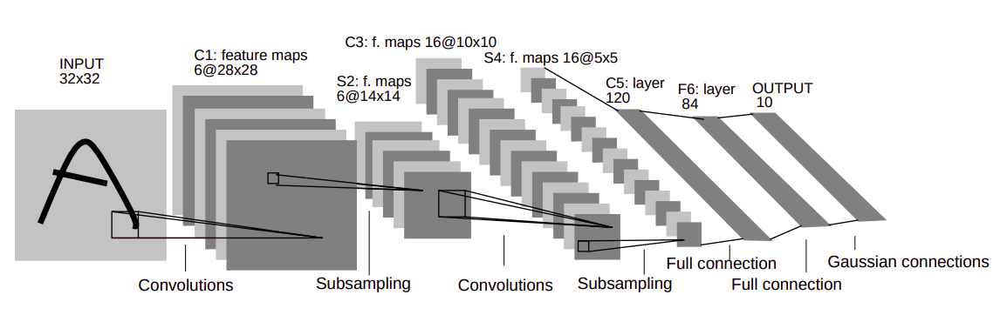

## LENET-5 : 
__Team Name__ – Outliers 
__Team Number__ – 13 
 

__Members:__ &nbsp; &nbsp; Suvadeep Maiti - 2021702021 
&emsp; &emsp;&emsp; &emsp; &emsp;Praguna Manvi - 2021701031 
&emsp; &emsp;&emsp; &emsp; &emsp;Haasith Pasala - 2021702017 
&emsp; &emsp;&emsp; &emsp; &emsp;Laksh Nanwani - 2021701002 

 

### Problem Statement:  

Implementing Lenet-5, a simple and straighforward convolutional neural network architecture with gradient-based learning, for recognizing handwritten digits, from scratch. Lenet-5 comprises of 7 layers, not counting the input, all of which contains trainable parameters(weights). It takes an input of 32x32 pixel image and outputs the likelihood of the digit present in the image.

### Project objectives: 
• Build Lenet – 5 from scratch using basic libraries such as NumPy. 
• Evaluate with inbuilt Lenet – 5 model trained with libraries. 
• Achieve an accuracy close to the paper’s on MNSIT test set. 
### Deliverables: 
• Preprocess MNSIT Dataset containing 60000 samples. 
• Implementing hidden layers and forward pass. 
• Implementing back-propagation from scratch. 
• Visualizing and comparing the results on MNSIT data set. 
### Code Structure
------------------

    ├── MNIST                         
    ├── images                    
    ├── src  
    ├   ├── Results
    ├   ├   ├── #plot images      
    ├   ├── notebooks 
    ├   ├   ├── Lenet.ipynb
    ├   ├   ├── model-relu-tanh-28-512-adam.pickle
    ├   ├── scripts 
    ├   ├   ├── RBF_init.py
    ├   ├   ├── model.py
    ├   ├── MNIST_auto_Download.py                          
    └── README.md
-----------
 
In the above structure, the source code is found in the 'src' directory in 'Lenet.ipynb' file. This notebook book file has
 
 

### Pre-requisites:
 
Before running the code, following python libraries are to be installed.

------------------
numpy  
opencv  
afsfa  
   
-----------
 

### Dataset:

We used the Modified NIST (MNIST) dataset which is a subset of the NIST database. It is a database of handwritten digits with a training set of 60,000 samples and a test set of 10,000 samples. This dataset is downloaded using MNIST_auto_Download.py file (found online). 
Ref: http://yann.lecun.com/exdb/mnist/
 
 

### Timeline (Year 2021):

 

| Timeline | Milestone |
| ------------- | ------------- |
| 26th Oct  | Project Allocation  |
| 7th Nov  | Project Proposal Submission  |
| 8th Nov - 11th Nov  | Paper and relevant work reading  |
| 12th Nov – 17th Nov  | Implementing hidden layers and forward pass |
| 18th Nov – 20th Nov  | Mid evaluation  |
| 21st Nov – 27th Nov  | Backpropagation implementation  |
| 27th Nov – 3rd Dec  | Training, testing, Analysis and ppt preparation  |
| 4th Dec  | Final Evaluation  |

 

### Work Distribution: 
 

| Member | Tasks |
| ------------- | ------------- |
| Suvadeep | Preprocessing, Convolution - Forward & backward |
| Praguna  | Training, Sub-sampling, Combining layers |
| Laksh | Testing, Full connection - Forward & backward |
| Haasith | PPT, Gaussian connections - Forward & backward  |

 

### References: 
1. http://vision.stanford.edu/cs598_spring07/papers/Lecun98.pdf 
