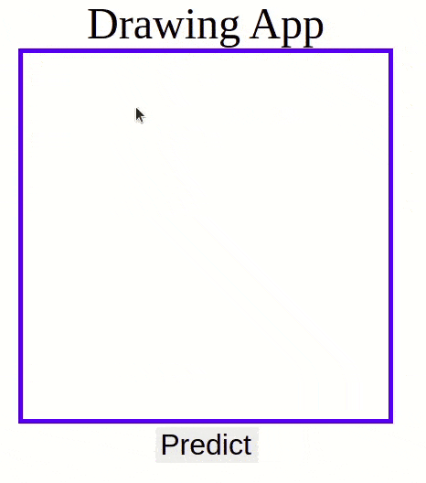

## LENET-5 : 
__Team Name__ – Outliers 
__Team Number__ – 13 
 

__Members:__ &nbsp; &nbsp; Suvadeep Maiti - 2021702021 
&emsp; &emsp;&emsp; &emsp; &emsp;Praguna Manvi - 2021701031 
&emsp; &emsp;&emsp; &emsp; &emsp;Haasith Pasala - 2021702017 
&emsp; &emsp;&emsp; &emsp; &emsp;Laksh Nanwani - 2021701002 
 

### Problem Statement:  

Implementing Lenet-5, a simple and straighforward convolutional neural network architecture with gradient-based learning, for recognizing handwritten digits, from scratch. Lenet-5 comprises of 7 layers, not counting the input, all of which contains trainable parameters(weights). It takes an input of 32x32 pixel image and outputs the likelihood of the digit present in the image.

### Project objectives: 
• Build Lenet – 5 from scratch using basic libraries such as NumPy. 
• Evaluate with inbuilt Lenet – 5 model trained with libraries. 
• Achieve an accuracy close to the paper’s on MNSIT test set. 
### Deliverables: 

• Preprocess MNSIT Dataset containing 60000 samples. 
• Implementing hidden layers and forward pass. 
• Implementing back-propagation from scratch. 
• Visualizing and comparing the results on MNSIT data set.

 

### Code Structure
------------------

    ├── MNIST      #Dataset                       
    ├── images     #Images for readme file               
    ├── src  
    ├   ├── Results
    ├   ├   ├── #plot images      
    ├   ├── notebooks 
    ├   ├   ├── Lenet.ipynb
    ├   ├   ├── model-relu-tanh-28-512-adam.pickle  #Best model
    ├   ├   ├── #Some other experimental models
    ├   ├── scripts 
    ├   ├   ├── RBF_init.py
    ├   ├   ├── main.py
    ├   ├   ├── lenet.py
    ├   ├   ├── layers.py
    ├   ├── app 
    ├   ├   ├── static
    ├   ├   ├── templates
    ├   ├   ├── app.py
    ├   ├── MNIST_auto_Download.py                          
    └── README.md
-----------
 
In the above structure, the source code is found in the 'src' directory.The scripts folder in this directory consists of code related to layers, Lenet-5 and RBF weights inititialisation. The notebooks folder has Lenet.ipynb which has code for training, testing and analysis.
 
 

### Pre-requisites:
 
Before running the code, following python libraries are to be installed.

------------------
numpy  
matplotlib  
opencv2  
flask  
tabulate  
sklearn  
  
-----------
 

### Dataset:

We used the Modified NIST (MNIST) dataset which is a subset of the NIST database. It is a database of handwritten digits with a training set of 60,000 samples and a test set of 10,000 samples.  
Ref: http://yann.lecun.com/exdb/mnist/
 

### Running the drawing app:

We built an application to test the working of the Lenet-5 model. To check it please follow the below steps.  
    1. Go to the 'app' directory and then execute the 'app.py' file.  
    2. From the terminal, you need to open the url (i.e 'http://127.0.0.1:5000/'). 
    3. Draw the numbers from 0 to 9 in the given box and then click on predict. This will predict the written digit and the result is diplayed.
 

The result is supposed to be : 
 

### Timeline (Year 2021): 
 

| Timeline | Milestone |
| ------------- | ------------- |
| 26th Oct  | Project Allocation  |
| 7th Nov  | Project Proposal Submission  |
| 8th Nov - 11th Nov  | Paper and relevant work reading  |
| 12th Nov – 17th Nov  | Implementing hidden layers and Forward pass |
| 18th Nov – 20th Nov  | Mid evaluation  |
| 21st Nov – 30th Nov  | Backpropagation implementation  |
| 1st Dec – 4th Dec  | Code Verification, Training, Testing, Analysis  |
| 4th Dec – 5th Dec  | Code documentation and cleaning, GUI implementation  |
| 6th Dec  | PPT preparation  |
| 7th Dec  | Project Submission  |
| 10th Dec  | Viva  |

 

### Work Distribution: 
 

| Member | Tasks |
| ------------- | ------------- |
| Suvadeep | Activation functions, forward propagation, report formatting and model fine tuning |
| Praguna  | Gradient computation, optimizing performance, fine tuning, adam optimizer and flask visual tool |
| Laksh | Forward propagation, preprocessing, model fine tuning, and code reorganisation |
| Haasith | Model training, evaluation and fine tuning,  back propagation and flask visual tool |

 

### References: 

Lenet :   Yann LeCun, Leon Bottou, Yoshua Bengio and Patrick HanerLenet, http://vision.stanford.edu/cs598_spring07/papers/Lecun98.pdf,  IEEE NOVEMBER 1998

Adam : Diederik P. Kingma, Jimmy Lei Ba, https://arxiv.org/pdf/1412.6980.pdf,  ICLR 2015

Visual Tool : https://github.com/hugom1997/Flask-Cnn-Recognition-App
